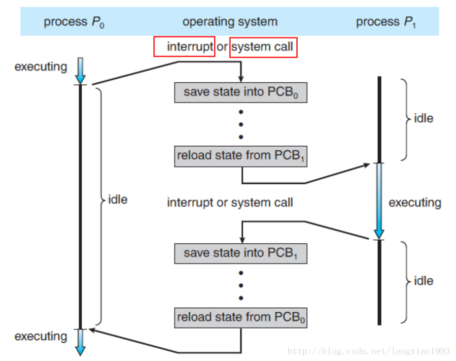

Q: 如何理解异步, 同步, 阻塞和非阻塞? 讲讲他们的概念和区别.

这是一篇学习笔记. 参考了网上同学们的回答. 参考链接:

- [怎样理解阻塞非阻塞与同步异步的区别?](https://www.zhihu.com/question/19732473)
- [同步/异步，阻塞/非阻塞概念深度解析](https://blog.csdn.net/lengxiao1993/article/details/78154467) (本笔记大量来源是这里)
- [Linux IO模式及select, poll, epoll详解](https://segmentfault.com/a/1190000003063859) 

## 导航

- [段子](#duanzi)
- [深度解析](#2)
  - [用户空间和内核空间](#2.1)
  - [进程切换](#2.2)
  - [进程阻塞](#2.3)
  - [I/O模式](#2.4)
- [为什么容易混淆](#3)

## <a id="duanzi">段子</a> 

一个形象的段子:

老张爱喝茶，废话不说，煮开水。

出场人物：老张，水壶两把（普通水壶，简称水壶；会响的水壶，简称响水壶）。

1 老张把水壶放到火上，立等水开。（同步阻塞）

老张觉得自己有点傻

2 老张把水壶放到火上，去客厅看电视，时不时去厨房看看水开没有。（同步非阻塞）

老张还是觉得自己有点傻，于是变高端了，买了把会响笛的那种水壶。水开之后，能大声发出嘀~~~~的噪音。

3 老张把响水壶放到火上，立等水开。（异步阻塞）

老张觉得这样傻等意义不大

4 老张把响水壶放到火上，去客厅看电视，水壶响之前不再去看它了，响了再去拿壶。（异步非阻塞）

老张觉得自己聪明了。

感觉像是那么回事. 但是这并不严谨. 

## <a id="2">深度解析</a>

- 同步(Synchronous)
- 异步(Asynchronous)
- 阻塞(Blocking )
- 非阻塞(Nonblocking)

<<操作系统概念>>一书中有关进程间通信的部分是这么解释的:

> 进程间的通信时通过 send() 和 receive() 两种基本操作完成的。具体如何实现这两种基础操作，存在着不同的设计。
>
> 消息的传递有可能是**阻塞**的或**非阻塞**的 – 也被称为**同步**或**异步**的：
>
> 阻塞式发送（blocking send）. 发送方进程会被一直阻塞， 直到消息被接受方进程收到。
>
> 非阻塞式发送（nonblocking send）。 发送方进程调用 send() 后， 立即就可以其他操作。
>
> 阻塞式接收（blocking receive） 接收方调用 receive() 后一直阻塞， 直到消息到达可用。
>
> 非阻塞式接受（nonblocking receive） 接收方调用 receive() 函数后， 要么得到一个有效的结果， 要么得到一个空值， 即不会被阻塞。
>
> 上述不同类型的发送方式和不同类型的接收方式，可以自由组合

也就是说, 从进程级通信的维度讨论时， 阻塞和同步（非阻塞和异步）就是一对同义词， 且需要针对**发送方**和**接收方**作区分对待。 

### <a id="2.1">用户空间和内核空间</a>

操作系统为了支持多个应用同时运行，需要保证不同进程之间相对独立（一个进程的崩溃不会影响其他的进程 ， 恶意进程不能直接读取和修改其他进程运行时的代码和数据）。 因此操作系统内核需要拥有高于普通进程的权限， 以此来调度和管理用户的应用程序。

于是内存空间被划分为两部分，一部分为内核空间，一部分为用户空间，内核空间存储的代码和数据具有更高级别的权限。内存访问的相关硬件在程序执行期间会进行访问控制（ Access Control），使得用户空间的程序不能直接读写内核空间的内存。

### <a id="2.2">进程切换</a>

(图片转自https://blog.csdn.net/lengxiao1993/article/details/78154467)

上图展示了进程切换中几个最重要的步骤：

1. 当一个程序正在执行的过程中， 中断（interrupt） 或 系统调用（system call） 发生可以使得 CPU 的控制权会从当前进程转移到操作系统内核。
2. 操作系统内核负责保存进程 `i` 在 CPU 中的上下文（程序计数器， 寄存器）到 `PCBi` 操作系统分配给进程的一个内存块）中。
3. 从 `PCBj` 取出进程 j 的CPU 上下文， 将 CPU 控制权转移给进程 j ， 开始执行进程 j 的指令。

### <a id="2.3">进程阻塞</a>

上图展示了一个进程的不同状态：

- New. 进程正在被创建.
- Running. 进程的指令正在被执行
- Waiting. 进程正在等待一些事件的发生（例如 I/O 的完成或者收到某个信号）。
- Ready. 进程在等待被操作系统调度。
- Terminated. 进程执行完毕（可能是被强行终止的）。

我们所说的 **“阻塞”**是指进程在发起了一个**系统调用（System Call）** 后， 由于该系统调用的操作不能立即完成，需要等待一段时间，于是内核将进程挂起为**等待 （waiting）**状态， 以确保它不会被调度执行， 占用 CPU 资源。

这里再重新审视 阻塞/非阻塞 IO 这个概念， 其实阻塞和非阻塞描述的是进程的一个操作是否会使得进程转变为“等待”的状态， 但是为什么我们总是把它和 IO 连在一起讨论呢？

原因是， 阻塞这个词是与系统调用 System Call 紧紧联系在一起的， 因为要让一个进程进入 等待（waiting） 的状态, 要么是它主动调用 wait() 或 sleep() 等挂起自己的操作， 另一种就是它调用 System Call, 而 System Call 因为涉及到了 I/O 操作， 不能立即完成， 于是内核就会先将该进程置为等待状态， 调度其他进程的运行， 等到 它所请求的 I/O 操作完成了以后， 再将其状态更改回 ready 。

操作系统内核在执行 System Call 时， CPU 需要与 IO 设备完成一系列物理通信上的交互， 其实再一次会涉及到阻塞和非阻塞的问题， 例如， 操作系统发起了一个读硬盘的请求后， 其实是向硬盘设备通过总线发出了一个请求，它即可以阻塞式地等待IO 设备的返回结果，也可以非阻塞式的继续其他的操作。 在现代计算机中，这些物理通信操作基本都是异步完成的， 即发出请求后， 等待 I/O 设备的中断信号后， 再来读取相应的设备缓冲区。 但是，大部分操作系统默认为用户级应用程序提供的都是阻塞式的系统调用 （blocking systemcall）接口， 因为阻塞式的调用，使得应用级代码的编写更容易（代码的执!行顺序和编写顺序是一致的）。

但同样， 现在的大部分操作系统也会提供非阻塞I/O 系统调用接口（Nonblocking I/O system call）。 一个非阻塞调用不会挂起调用程序， 而是会立即返回一个值， 表示有多少bytes 的数据被成功读取（或写入）。

非阻塞I/O 系统调用( nonblocking system call )的另一个替代品是 异步I/O系统调用 （asychronous system call）。 与非阻塞 I/O 系统调用类似，asychronous system call 也是会立即返回， 不会等待 I/O 操作的完成， 应用程序可以继续执行其他的操作， 等到 I/O 操作完成了以后，操作系统会通知调用进程（设置一个用户空间特殊的变量值 或者 触发一个 signal 或者 产生一个软中断 或者 调用应用程序的回调函数）。

此处， 非阻塞I/O 系统调用( nonblocking system call ) 和 **异步I/O系统调用 （asychronous system call）**的区别是：

一个非阻塞I/O 系统调用 read() 操作立即返回的是任何可以立即拿到的数据， 可以是完整的结果， 也可以是不完整的结果， 还可以是一个空值。

而异步I/O系统调用 read（）结果必须是完整的， 但是这个操作完成的通知可以延迟到将来的一个时间点。

注意， 上面提到的 **非阻塞I/O 系统调用( nonblocking system call )** 和 **异步I/O系统调用** 都是非阻塞式的行为（non-blocking behavior）。 他们的差异仅仅是返回结果的方式和内容不同。 

### <a id="2.4">I/O模式</a>

<<Unix网络编程>>中提及了5种类Unix下可用的I/O模型

- 阻塞式I/O；
- 非阻塞式I/O；
- I/O复用（select，poll，epoll...）；
- 信号驱动式I/O（SIGIO）；
- 异步I/O（POSIX的aio_系列函数）；

#### 阻塞式I/O

在linux中, 默认情况下所有的socket都是blocking，一个典型的读操作流程大概是这样： 

1. 等待数据准备好 
2. 从内核向进程复制数据 

#### 非阻塞式I/O

当用户进程发出read操作时，如果kernel中的数据还没有准备好，那么它并不会block用户进程，而是立刻返回一个error。从用户进程角度讲 ，它发起一个read操作后，并不需要等待，而是马上就得到了一个结果。用户进程判断结果是一个error时，它就知道数据还没有准备好，于是它可以再次发送read操作。一旦kernel中的数据准备好了，并且又再次收到了用户进程的system call，那么它马上就将数据拷贝到了用户内存，然后返回。 

所以，nonblocking IO的特点是用户进程需要**不断的主动询问**kernel数据好了没有。 

#### I/O多路复用

IO multiplexing就是我们说的select，poll，epoll，有些地方也称这种IO方式为event driven IO。select/epoll的好处就在于单个process就可以同时处理多个网络连接的IO。它的基本原理就是select，poll，epoll这个function会不断的轮询所负责的所有socket，当某个socket有数据到达了，就通知用户进程.

#### 异步I/O

用户进程发起read操作之后，立刻就可以开始去做其它的事。而另一方面，从kernel的角度，当它受到一个asynchronous read之后，首先它会立刻返回，所以不会对用户进程产生任何block。然后，kernel会等待数据准备完成，然后将数据拷贝到用户内存，当这一切都完成之后，kernel会给用户进程发送一个signal，告诉它read操作完成了 

## <a id="3">为什么容易混淆</a>

因为这个问题是一个多层次的问题. 

举个例子, 一个网络包从`APP A` 发到 `APP B` 需要经历:

1. 从A的业务代码到A的软件框架
2. 从A的软件框架到计算机的操作系统内核
3. 从A所在计算机的内核到网卡
4. 从网卡经过网线发到交换机等设备，层层转发，到达B所在计算机的网卡
5. 从B所在计算机的网卡到B所在计算机的内核
6. 从B所在计算机的内核到B的程序的用户空间
7. 从B的软件框架到B的业务代码

这里有一个层级关系, 只有在单独一级的调用上, 可以说同步还是异步的问题. 1和7是取决于框架的设计. 2和6见上面分析. 3和5一般是异步的. 4, 以太网是个同步时序逻辑，随信号传输时钟，必须两边设备同时就绪了才能开始传输数据，这又是同步的。 

简单地说分三个层次

#### 操作系统层次

操作系统进行IO和任务调用的层次, 现代操作系统通常使用异步非阻塞方式进行IO.

#### 线程层次

操作系统为了减轻程序员的思考负担，将底层的异步非阻塞的IO方式进行封装，把相关系统调用（如read，write等）以同步的方式展现出来。然而，同步阻塞的IO会使线程挂起，同步非阻塞的IO会消耗CPU资源在轮询上。为了解决这一问题，就有3种思路：

1. 多线程（同步阻塞）；
2. IO多路复用（select，poll，epoll）（同步非阻塞，严格地来讲，是把阻塞点改变了位置）；
3. 直接暴露出异步的IO接口，如kernel-aio和IOCP（异步非阻塞）。

#### 业务代码感知层次

这就要看具体的语言, 软件框架了. 如Node.js就通过回调函数, 提供了异步非阻塞的API.

因此，我们在讨论同步、异步、阻塞、非阻塞时，必须先明确是在哪个层次进行讨论。比如node.js，我们可以说她在业务代码感知层次提供了异步非阻塞的API，也可以说在Linux下，她在线程层次以同步非阻塞的epoll来实现。 

